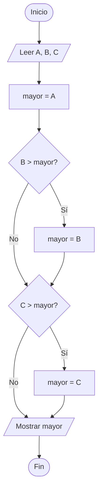

# 02 · Mayor de tres

## Descripción

Dado tres números enteros **A**, **B** y **C**, determina cuál es el mayor.

### Ejemplo

| Entrada        | Salida   |
|----------------|----------|
| A=5, B=9, C=3  | Mayor: 9 |
| A=7, B=2, C=7  | Mayor: 7 |
| A=1, B=1, C=1  | Mayor: 1 |

---

## Estrategia

Utilizamos comparaciones **secuenciales**:

1. Se asume que `mayor = A`.
2. Si `B > mayor`, entonces `mayor = B`.
3. Si `C > mayor`, entonces `mayor = C`.
4. Se muestra `mayor`.

Este enfoque funciona correctamente para todos los casos, incluyendo empates.

---

## Diagrama de flujo

---

## Código solución

Ver [soluciones/mayor-de-tres.js](../soluciones/mayor-de-tres.js)
