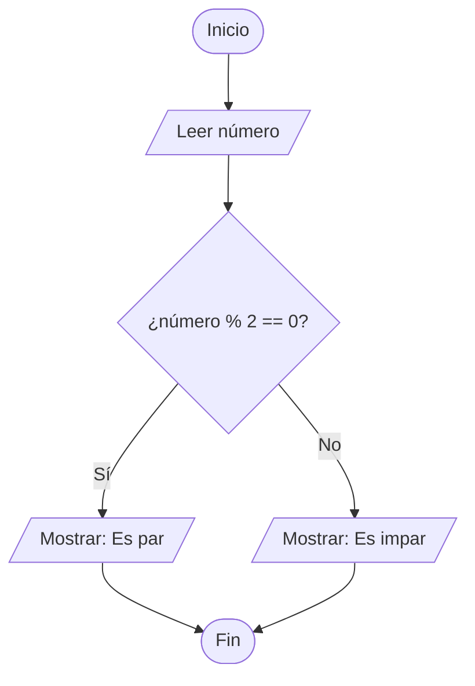

# Ejercicio: ¿El número es par o impar?

## Problema

Dado un número entero, determinar si es **par** o **impar**.

**Pista:** Un número es par si al dividirlo entre 2 su residuo es 0.

---

## Diagrama de flujo

---

## Pasos del algoritmo

1. **Inicio**
2. Leer el número ingresado por el usuario
3. Calcular el residuo de dividir el número entre 2 (`número % 2`)
4. ¿El residuo es igual a 0?
   - **Sí** → mostrar "Es par"
   - **No** → mostrar "Es impar"
5. **Fin**

---

## Casos de prueba

| Entrada | Esperado |
|---------|----------|
| 4       | Es par   |
| 7       | Es impar |
| 0       | Es par   |
| -3      | Es impar |

---

➡️ Solución en JavaScript: [`../soluciones/par-impar.js`](../soluciones/par-impar.js)
